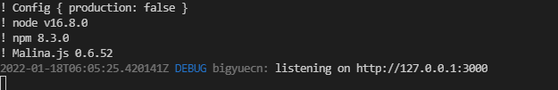
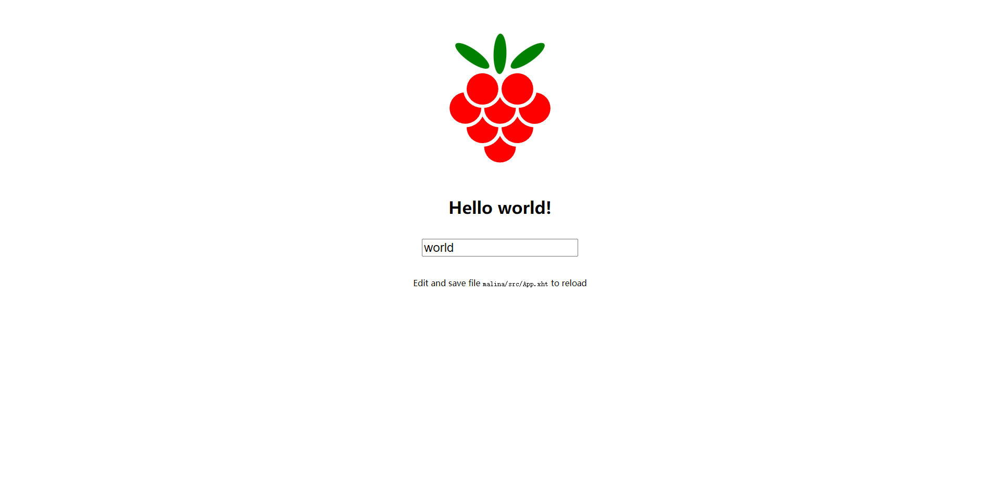

# template-axum-malina

## requirements

- [x] `Rust`
- [x] `nodejs`

## usage

`cargo run` will create a malina app in `malina` fold. And this is created by `npx create-malina malina`, then I made some changes to adapt to our project. (This is done by program, so you don't need to do it again, and you can also do some change to meet your project.)

- remove `public` dir in `malina`
- remove `.gitignore` and `README.md` file in `malina`
- modify `rollup.config.js` and `src/App.xht` in `malina`

by default, malina would generate `bundle.js` and `bundle.css` (if `CSSINJS` is false) in `static` file.

## screeshots

